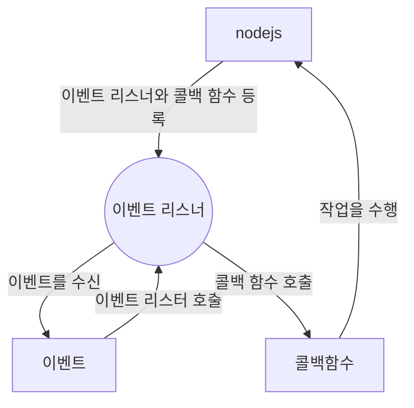

# Nodejs란?

## nodeJS란 서버???

- nodejs 자체가 웹서버가 아니고  
  nodejs는 js를 사용해서 사용해서 서버 측에 코드들을  작성하고 서버를 구축할 수 있게 도와주고  
  개발 생산성을 위해 npm을 통해 모듈을 제공한다.

## npm(node pacakage manager)란?

- 개발자들이 작성한 자신의 모듈을 공유할 수 있는  패키지 저장소 npm을 사용하면 모듈을 쉽게 설치받아서 사용할 수 있다. 
  node.js가 개발된 이유는 웹서버 개발을 하기위해서도 있지만  방대한 오픈소스 생태계를 구축하기 위해서 개발자들이 편리하게  
  개발할 수 있게 개발 생산성을 향상 시켜주기 위해서.

## chrome v8 javascript

- chrome V8 javascript 엔진으로 `build`된
   서버 측 자바스크립트 런타임 환경  
  브라우저와 런타임환경이 다릅니다.

- build가 되었다는 건 구글에서 개발한 v8 javascript 엔진을 사용해서 build를 한다.  
  build라는건 코드를 컴파일러를 통해 실행파일로 변환하는 작업이라고 보면됨

- 구글에서 개발한 v8 javascript 엔진은 2008년도   오픈소스로 공개하고 구글에서 개발한  
  js엔진을 사용하고 `비동기 I/O` 와 `이벤트 기반의 아키텍쳐`를 채택해서 속도가 빠르고 성능이 좋다.

## nodeJs의 블로킹과 논블로킹

- nodejs에서 `비동기 I/O` 작업을 진행하는 동안 또 다른 작업을 실행 할 수 있다. (nodeJS의 장점)
- I/O 작업이 완료될 떄 까지 기다리면서 다른 코드를 또 실행 시킬 수 있다.  
  Input/Output:파일 시스템 (브라우저에서 파일을 조작할 순 없다.) 네트워크,디스크 등  
  데이터를 읽거나 쓰거나 하는 작업을(무거운 작업들)
- 블로킹이란 한 작업이 끝날 때 까지 다른 작업을 수행하지 않는것  
블로킹 I/O 작업은 수행하는 동안 다른 코드의 실행이  중단된다.
- 논블로킹이란 I/O 작업을 기다리는 동안 다른 코드들을
실행할 수 있게 하는것  

nodejs는 모든 I/O 작업은 비동기적으로 실행되고 
블로킹을 하지 않는다.

## nodejs의 이벤트 기반의 아키텍쳐
- nodejs 가장 큰 특징으로 이벤트 기반의 아키텍처가 있다.  이벤트 기반의 프로그래밍은 이벤트가 발생하면 콜백 함수를 실행시키는 방식  
이벤트 기반의 프로그래밍을 작성하면 비동기식 처리가 가능하고  좋은 성능과 확장성을 가질 수 있다.

- 이벤트 기반
 이벤트를 실행시키면 이벤트로 등록한 작업을 수행하는것
 우리가 자바스크립트에서 클릭 같은 이벤트에 콜백함수를 작성해놓고  이벤트 기반의 특정 이벤트가 발생하면 등록시킨 콜백함수를 호출해서 실행 시킨다.
  이런 내용을 `이벤트 리스너에 콜백함수를 등록한다.`

- nodejs는 이벤트가 발생하면 이벤트에 등록된 콜백 함수를 호출하고 이벤트를 다 처리하면  
다음 이벤트 발생까지 대기한다.

